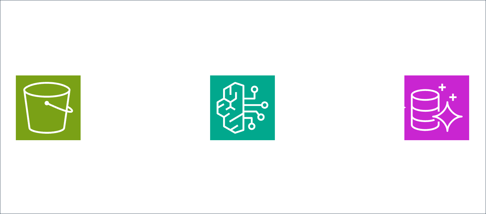

## Bedrock Knowledge Base with RDS and S3


In this repository we will learn how to build a Knowledge Base with AWS.

Here you can find more about this repository.

https://superluminar.io/2025/04/22/a-practical-guide-of-how-to-build-a-knowledge-base-with-rds-and-documents-from-s3/

## How to deploy:

**Configure your account id:**
- goto `bin/knowledgebase.ts`
- change `YOUR_ACCOUNT_ID` in `defaultStackProperties`.

**Install Dependencies**
```bash
npm i
```

**Deploy the solution:**
```bash
npx cdk deploy --all
```


## How to test:
**Once everything is deployed:**
- go to your AWS Account
- go to the lambda function `resolveQuestion`
- invoke it with test event `{"question":"How to reset password?"}`


## Extras:
You can also add your own documents to `documents` and just redeploy `knowledgebase-example-agent-knowledgebase`.  
This will trigger a `startIngestionJob`, which will re-index your knowledge base with the new documents.


